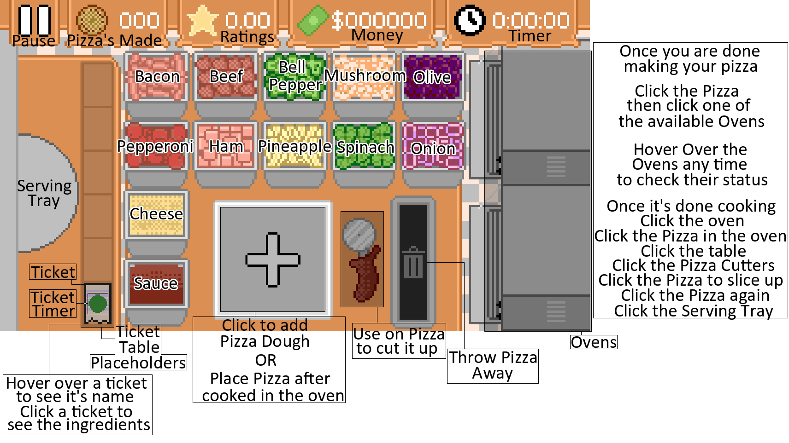

# Read Me Before Play

Overview of Gotta Make Pizza.

## Description

It's a 2D fast-pace arcade style of making pizzas.

## Getting Started

### Dependencies

- Only on Windows.

### Installing + Playing

- [Download](https://github.com/)
- Extract .zip of GottaMakePizza.zip
- Double left click GottaMakePizza.exe

## How to play

After clicking the Play button in game.

- Tickets will start coming in on your left.
- Hover over a ticket to see its name.
- Click on the ticket to see what ingredients go on the pizza.
- For example, if the ticket says 'pepperoni1'
- Clicking it reveals, you need Sauce, than Cheese, and 12 pepperoni slices.
- First Click the plus sign on the table with a square around it.
- This creates the pizza dough
- Next, click the red sauce, located left of the pizza.
- After clicking the sauce, click the pizza to place the sauce on the pizza.
- Do the same with the Cheese.
- Next, Click the pepperoni container, and click the pizza 12 times.
- Right-click to unselect anytime.
- Click the pizza and click on one of the open ovens.
- Click the Oven again to start cooking the pizza.
- Once the timer ends, Click on the oven to release the pizza.
- Click on the freshly cooked pizza.
- Then click the table.
- Once on the table, you can cut the pizza up with the pizza cutters to the right of the pizza.
- Once cut, click the pizza and click the serving tray, on the left side of the screen.
- You did it, that is how you play.
- Repeat, until you lose all your ratings. (The Star with numbers in the top middle of the screen)

Here is a helpful pic

## Authors

Contributors names and contact info

Robert Sabo - I made this.
[@robbysabo](https://github.com/robbysabo)

Michele Mallia - She made the music.
[@michelemallia9931](https://www.youtube.com/@michelemallia9931)

## Version History

- 1.0
  - Initial Release
